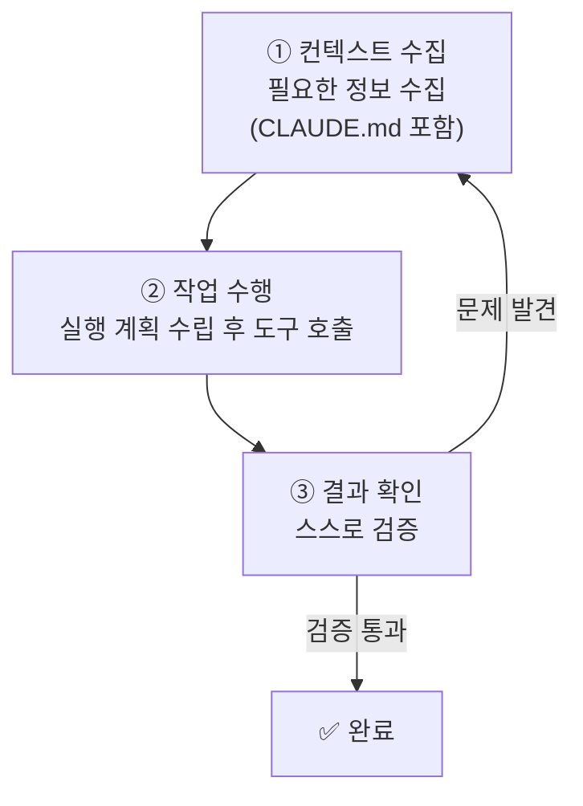
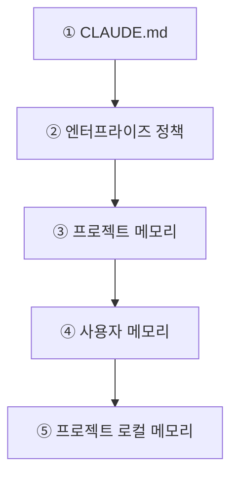
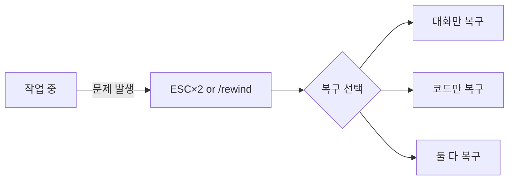
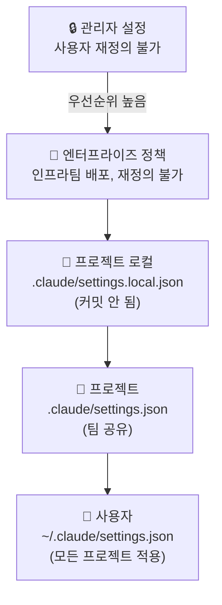

# 📚 1주차 | Ch.01\~02 | 스터디장

> **날짜:** 2025-07-05 | **챕터:** Ch.01 Claude Code · Ch.02 워크플로와 설정 | **페이지 참고:** p.03 \~ p.64

---

## 0. 기본 용어

| 용어 | 설명 |
| --- | --- |
| **린트 (Lint)** | 소스 코드에서 문법 오류·버그·스타일 위반 등 잠재적 문제를 찾아내는 정적 분석 행위 |
| **CI/CD 파이프라인** | 소프트웨어의 빌드·테스트·배포 과정을 자동화하여 빠르고 안정적으로 제공하는 개발 파이프라인 |

---

## Ch.01 — Claude Code

### 1. 에이전틱 루프

> 💡 Claude Code가 도구를 호출하고 결과를 받아 다음 행동을 결정하는 반복 실행 구조



> ⚙️ **결과 확인 방식 3가지**
>
> - 규칙 기반 피드백
> - 시각적 피드백
> - LLM 기반 평가

---

### 2. 컨텍스트 윈도우

> 💡 Claude가 한 번의 추론에서 참조할 수 있는 **토큰의 총량**

**적재 순서 (위에서부터 우선 적용)**



**관리 전략**

| 전략 | 설명 | 적합한 상황 |
| --- | --- | --- |
| 컴팩션 | 98% 도달 시 자동 요약 | 자동 처리 |
| `/clear` | 컨텍스트 초기화 | 새 작업 시작 |
| 점진적 공개 | 필요 시 skill로 로드 | 대형 프로젝트 |
| 서브에이전트 | 별도 컨텍스트에서 요약 후 반환 | 병렬 작업 |
| 구조화된 메모 | 단계별 작업 메모 활용 | 대규모 마이그레이션 |

**Claude 접근 영역** (`settings.json` → `permissions`로 제어)

| 영역 | 설명 |
| --- | --- |
| 파일시스템 | 디렉토리 내 파일 읽기·쓰기·편집 |
| 터미널 | Shell 명령 실행 (Bash) |
| 웹 | 인터넷 정보 검색 |
| MCP 서버 | 외부 도구·데이터 소스 연결 |
| 에디터 컨텍스트 | VSCode·JetBrains IDE 직접 연동 |

> 📌 **MCP 서버 범위**
>
> - 로컬 범위 — 현재 프로젝트에서만 사용
> - 프로젝트 범위 — `.mcp.json`을 통해 팀 공유
> - 사용자 범위 — 모든 프로젝트에서 사용

---

### 3. CLI 기초

| 명령어 | 설명 | 용도 |
| --- | --- | --- |
| `claude` | 대화형 모드 | 탐색·장기 세션 |
| `claude -p` | 비대화형 모드 | 스크립팅·자동화 |
| `claude -c` | 이전 대화 복원 | 세션 재개 |
| `claude -r` | 과거 대화 목록 선택 | 이전 세션 불러오기 |

**필수 슬래시 명령어**

| 명령어 | 기능 |
| --- | --- |
| `/help` | 도움말 |
| `/clear` | 컨텍스트 초기화 |
| `/rewind` | 이전 상태 복구 |
| `/exit` | 종료 |
| `/doctor` | 설치 상태 진단 (p.21) |

---

### 4. 체크포인트 & 되감기

> 💡 파일 편집을 자동 추적하는 **실행 취소 안전망** (보관 30일)

**사용법:** `ESC` 두 번 또는 `/rewind`

**복구 옵션:** 대화만 / 코드만 / 둘 다



**유용한 상황**

- ✅ 대체 구현을 탐색해야 할 때
- ✅ 잘못된 변경으로 복구해야 할 때
- ✅ 작동하는 현 상태를 유지하며 테스트할 때

**한계**

- ❌ Bash를 통한 파일 변경 추적 불가
- ❌ 외부 변경 사항 기록 안 됨 (Git 작업 트리 병렬 워크플로 주의)
- ❌ 버전 관리 시스템의 대체재가 아님

---

### 5. 프로젝트 모드 & 유용한 기능

**모드** (`Shift+Tab`으로 전환)

| 모드 | 설명 | CLI 옵션 |
| --- | --- | --- |
| Plan Mode | 계획·제안 특화 | `--permission-mode plan` |
| Edit Mode | 변경마다 승인 요청 | — |
| Bypass Mode | 전권 위임 | — |

**유용한 기능**

- `@파일명` — 특정 파일 명시적 참조
- `Tab` — 파일명 자동 완성
- 이미지 첨부 — `Ctrl+V` 붙여넣기 / 드래그앤드롭 / 경로 직접 지정

---

## Ch.02 — 워크플로와 설정

### 1. 기본 작업 방식


**TDD 방법론 (Red-Green-Refactor)**

| 단계 | 내용 |
| --- | --- |
| 🔴 RED | 구현할 기능의 예상 동작 정의 테스트 작성 |
| 🟢 GREEN | 테스트 통과를 위한 최소한의 코드 작성 |
| 🔵 REFACTOR | 기능 유지 → 구조 개선 및 중복 제거 |

**AI 코드 리뷰 자동화 예시** (`package.json`)

```json
{
  "scripts": {
    "lint": "eslint src/",
    "lint:claude": "claude -p '너는 코드 리뷰어야. main 브랜치 대비 변경된 코드를 검토하고 오타, 네이밍 오류, 잠재적 버그를 찾아줘.'"
  }
}
```

실행: `npm run lint:claude`

---

### 2. settings.json 우선순위



> ⚠️ `deny` 규칙은 다른 모든 규칙보다 **항상 우선** 적용됨 평가 순서: `deny → ask → allow`

**자주 쓰는 설정**

| 키 | 설명 |
| --- | --- |
| `cleanupPeriodDays` | 로컬 채팅 기록 유지 기간 |
| `env` | 모든 세션에 적용할 환경변수 |
| `hooks` | 도구 실행 전후 명령 정의 |
| `additionalDirectories` | 접근 가능한 추가 작업 디렉토리 |
| `enableAllProjectMcpServers` | 프로젝트 MCP 서버 자동 승인 |

---

### 3. 확장 도구 비교

| 도구 | 설명 | 위치 |
| --- | --- | --- |
| **스킬** | 반복 워크플로 표준화, 사용자 요청 맥락 분석 후 활성화 | `.claude/skills/` |
| **서브에이전트** | 별도 컨텍스트에서 작업 | — |
| **MCP 서버** | Git·Notion·Figma 등 외부 연결 | `claude mcp add` |
| **훅** | 생애주기 이벤트 바인딩 (PreToolUse / PostToolUse 등) | `settings.json` |
| **플러그인** | 위 4가지를 하나의 배포 단위로 묶음 | `.claude-plugin/plugin.json` |

---

### 4. IAM 권한 & 보안

> 💡 **최소 권한 원칙** — 필요한 최소한의 권한만 부여

**샌드박스 설정:** `settings.json`의 `sandbox` 필드 활성화

**민감 파일 보호:** `deny` 규칙 활용

**모든 비필수 트래픽 비활성화:**

```bash
export CLAUDE_CODE_DISABLE_NONESSENTIAL_TRAFFIC=1
```

---

### 5. 모델 구성

| 모드 | 모델 | 적합한 상황 |
| --- | --- | --- |
| 기본 | Sonnet | 일반 개발 환경 |
| opusplan | 계획→Opus, 구현→Sonnet 자동 전환 | 복잡한 설계 작업 |

**프롬프트 캐싱:** 이전 요청 프롬프트 일부를 캐시에 저장 → API 호출 시간 단축·토큰 비용 절감

```bash
# Opus만 캐싱 비활성화
export DISABLE_PROMPT_CACHING_OPUS=1
```

---

> 📎 **다음 주 예고**발표자: **B** | 챕터: Ch.03 (에이전트 스킬) 준비: DART API 키 발급 (opendart.fss.or.kr)