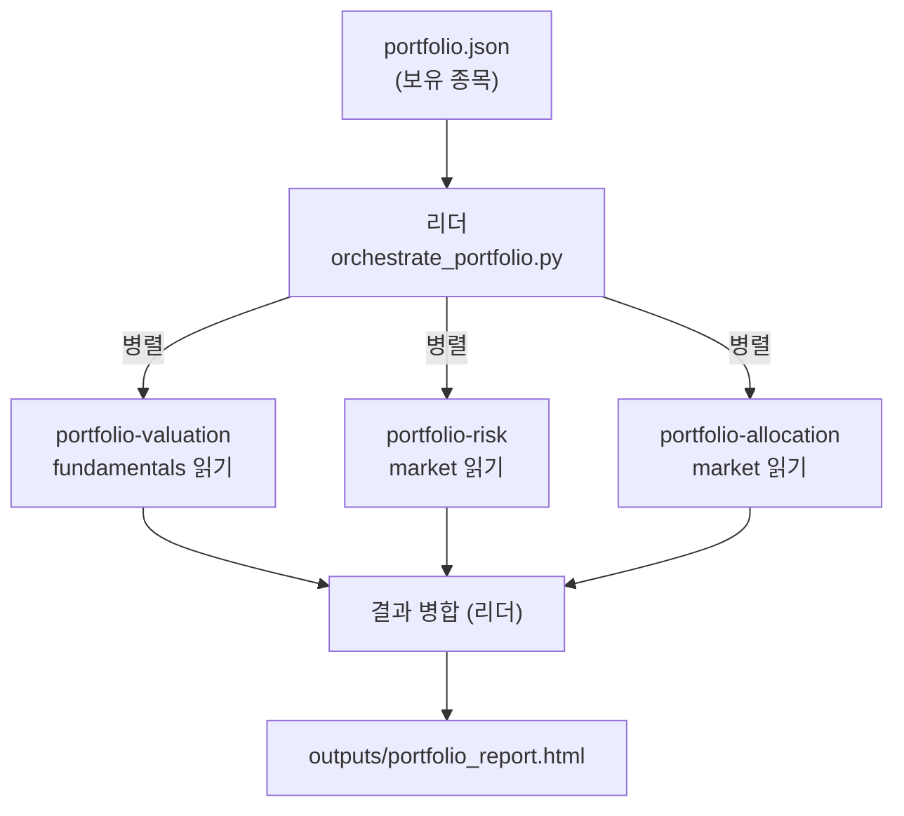

# 📚 4주차 | Ch.04 (2/2) | 김비오

> **날짜:** 2026-07-27 | **챕터:** Ch.04 커스텀 서브에이전트 · 에이전트 팀 · CLI 동적 활용 | **PR:** https://github.com/shiho2v/antshell/pull/8

---

## 0. 기본 용어

| 용어 | 설명 |
| --- | --- |
| **서브에이전트** | 독립 컨텍스트·전용 도구를 가진 '전문 일꾼'. `.claude/agents/*.md`로 정의 |
| **에이전트 팀** | 여러 서브에이전트가 구역을 나눠 **병렬·협업**하는 구성 |
| **파일 소유권** | 두 에이전트가 같은 파일을 쓰지 않게 구역을 분리 → 충돌 방지 |
| **오케스트레이터** | 팀원에게 일을 나눠주고 결과를 병합하는 리더 (헤드리스 `claude -p`) |

---

## 1. 핵심 개념

> 💡 **한 줄**: 스킬로 '무엇을 아는지'를 정했다면, 서브에이전트·팀으로 '**그 지식으로 어떻게 일하는지**'를 구현한다.

| 구분 | 무엇 | 핵심 |
| --- | --- | --- |
| **4-3 커스텀 서브에이전트** | `.md` 정의 파일 | name · description · tools · 시스템프롬프트 / 최소 권한 / 경계(`unknown`) 처리 |
| **4-4 에이전트 팀** | 리더 + 팀원 N | **파일 소유권**으로 충돌 방지 / 병렬 실행 / 해산까지 협업 |
| **4-5 CLI 동적** | `--agent` / `--agents` | 있는 걸 부르기 / 즉석 JSON 정의 · 헤드리스 자동화 |

> ⚙️ **정의 파일 vs 실행 인스턴스** — `.md` 정의는 디스크에 영구히 남고, 실행 인스턴스는 작업이 끝나면 소멸된다. 그래서 '소멸'은 파일이 지워지는 게 아니라 **그때 일한 일꾼이 사라진다**는 뜻.

---

## 2. 주식 웹 적용 — 포트폴리오 분석 에이전트 팀

3주차 '뉴스·재무 병렬화'를 **팀 단위**로 확장. 보유 종목을 3명의 전문가가 동시에 분석 → 종합 리포트.



**파일 소유권 (충돌 0)**

| 에이전트 | 읽는 파일 | 산출 |
| --- | --- | --- |
| portfolio-valuation | `data/{code}_fundamentals.json` | 고·저평가 판정 |
| portfolio-risk | `data/{code}_market.json` | 집중도·낙폭·수급 리스크 |
| portfolio-allocation | `data/{code}_market.json` (시세) | 리밸런싱 매수/매도/유지 |

> 📌 market.json은 risk·allocation이 함께 읽지만 **읽기 전용**이라 충돌 없음. 파일 쓰기는 리더만(`outputs/`).

---

## 3. 경계 케이스 테스트

데이터가 없는 종목을 일부러 섞어, **죽지 않고 `unknown`으로 처리**되는지 검증 (`data/portfolio.edge.json`).

| 확인 항목 | 결과 |
| --- | --- |
| 결측 종목(005380 · 999999) → verdict/overall/action = `unknown` | ✅ |
| 정상 종목(005930) 값 산출 (매출 +10.88%, 영업이익 +33.23%) | ✅ |
| 스크립트 중단 없이 HTML 리포트 생성 | ✅ |

> 💡 **발견**: 세 에이전트가 시키지 않은 `warnings` 필드를 스스로 붙여 "결측 종목이 분모에서 빠져 비중이 과대 계상됨"을 경고했다. 서브에이전트가 단순 실행기가 아니라 **도메인 판단**까지 한다는 산 증거.

**시연 명령**

```bash
# 정상
python scripts/orchestrate_portfolio.py --portfolio data/portfolio.example.json --save
# 경계(결측)
python scripts/orchestrate_portfolio.py --portfolio data/portfolio.edge.json --save
```

---

## 4. 회고

- 파일 소유권을 명시하니 병렬화가 안전해졌다 — 3주차 병렬화의 자연스러운 다음 단계.
- 경계 테스트가 렌더러의 잠재 크래시(`None` 숫자 포맷)를 미리 잡아줘 방어 코드를 추가했다.
- 한계: 밸류에이션이 성장률 기반 점수 — 향후 PER/PBR 멀티플 반영 여지.

> 📎 **다음 주 예고** — 발표자: **서동필** | 챕터: Ch.05~06
